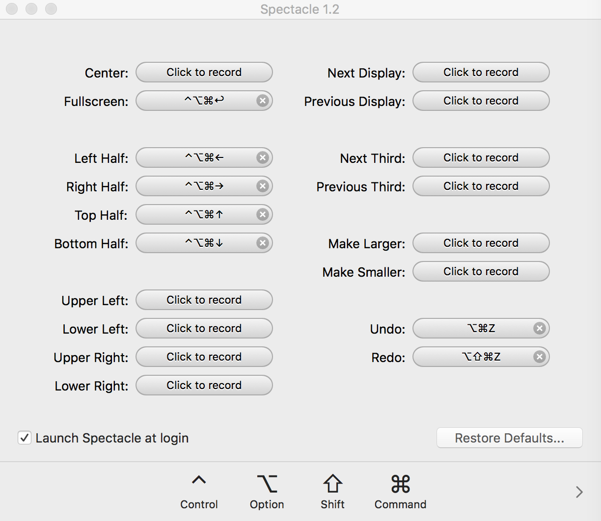

[toc]

# 1 hostname 
```
sudo scutil --set HostName sh
sudo scutil --set ComputerName sh
```

# 2 Spectacle

## 2.1 install 
unzip and launch, pull it into Application

## 2.2 config
 


# 3 HomeBrew

# 4 Iterm2